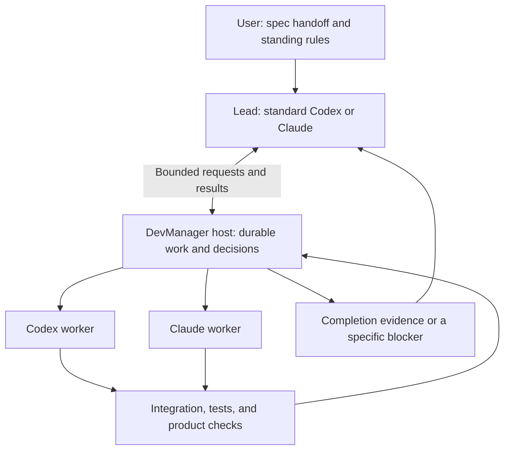

**DevManager: from managing sessions to completing goals**

Research date: September 7, 2026 (America/Vancouver). DevManager baseline: `VisualDevManager`, `e03a35c17aeb`; the `v0.4.1` manifest was also inspected. Status: research proposal, not an adopted architecture change. Working scope: software delivery for an individual or small team.

For the product scope prepared for step 4, use [spec/ai-orchestration/SPEC.md](../../spec/ai-orchestration/SPEC.md) and its [Context Pack](../../spec/CONTEXT-PACK.md). September 8 amendments A3–A4 supersede this report's finished-spec-only first milestone: briefs/problems, Command-first workloads, scoped memory/process improvement, and concurrent task leads are required. See the [Command inspection](2026-09-08-command-memory-and-concurrent-goals.md). The recommendation below records the earlier research position; implementation candidates here do not add requirements to the current SPEC.

This investigation combines source inspection with current primary documentation. The downloaded Traycer, Herdr, T3 Code, and Buzz directories are source archives without their own Git metadata; they are evidence about those snapshots, not verified upstream release checkouts. Zed's ACP integration was inspected narrowly. No provider workloads, Rust builds, live acceptance tests, product installations, or deployments were run. Vendor documentation establishes advertised behavior; it does not establish comparative reliability on our projects.

My recommendation is to keep DevManager's native host and change the next product milestone to executing a spec directory with one lead conversation. Robin's supplied workflow makes the handoff concrete: humans normally own discovery through completed feedback (Prompts 1–3); the lead owns build-doc generation, implementation, independent audit, E2E, fixes, and re-verification (4 onward). Robin's handoff means the spec is ready, whether or not its status says `LOCKED`; no separate lock confirmation is required. Use standard coding harnesses for the intelligent work. Add only the coordination that the native baseline cannot reliably supply. The companion [spec-directory execution proposal](2026-09-07-spec-directory-execution.md) defines this first product contract and reconciles the supplied prompts; it takes precedence over the broader examples below when choosing the initial scope.

We do need some application-specific orchestration to deliver that experience across providers and interruptions. We do not need to implement another coding agent's model/tool loop. The opportunity is a measurable reduction in how much work the human must coordinate. Native rendering, a large agent tree, and a broad provider catalog do not establish that improvement by themselves.

There are two decisions here. For the user's personal productivity, evaluate the providers' native goal/delegation features and Traycer before funding a large new subsystem. For DevManager as a product, build a narrow prototype and compare its results against those alternatives. If the alternatives already satisfy the actual workflow, adopting them is a successful outcome of this research.

The terminology matters:

| Layer | What it does | Proposed owner |
| --- | --- | --- |
| Model | Reasons about the problem and selects actions | The chosen model provider |
| Coding harness | Runs the model/tool loop, edits files, executes commands, manages conversation context and native subagents | Standard Codex or Claude Code |
| Goal orchestration | References the approved spec and policy, delegates bounded work, tracks execution, manages workspaces and recovery, checks completion | DevManager, using its existing host |
| Interface | Gives the user one conversation, progress, evidence, and intervention controls | Existing GPUI shell and Connect clients |

The lead can itself be an ordinary Codex or Claude session with good instructions and a few DevManager tools. When it needs another provider, it asks DevManager to start a bounded assignment. DevManager owns the resulting process and work record; the selected provider still owns how the worker reasons and uses tools.

**What already exists changes what is worth building.**

| Existing capability | Evidence and practical consequence |
| --- | --- |
| Codex subagents | Current releases support delegation, follow-ups, result collection, and per-agent configuration. Local delegation can be requested in the prompt or applicable project/skill instructions. Start by using this capability. [Official subagent documentation](https://learn.chatgpt.com/docs/agent-configuration/subagents). |
| Codex persistent goals and structured client integration | App-server documents persisted thread goals, explicit thread resume, streamed events, approvals, and authentication. This is the primary integration candidate for a native client. Probe the installed version before depending on individual methods. [App-server documentation](https://learn.chatgpt.com/docs/app-server). |
| Codex job automation | The Codex SDK controls local threads programmatically. It is distinct from the general OpenAI Agents SDK. The current guide also marks `codex mcp-server` deprecated; it should not become a new dependency. [Codex SDK](https://learn.chatgpt.com/docs/codex-sdk). |
| Claude dynamic workflows | Claude can write and run an orchestration script for staged or parallel subagent work, with per-stage model selection and saved results. Workflows support CLI and SDK surfaces. This deserves a baseline test before building a workflow language. [Dynamic workflows](https://code.claude.com/docs/en/workflows). |
| Claude agent teams | A lead coordinates peer sessions with shared tasks and messaging. Teams are still documented as experimental, with lifecycle limitations. Treat them as a useful option to evaluate, rather than assuming their state maps cleanly to DevManager. [Agent teams](https://code.claude.com/docs/en/agent-teams). |
| Claude programmatic execution | The Agent SDK embeds Claude Code's agent loop. A subprocess interface is available for other languages. This can reuse the harness while exposing structured execution. [SDK overview](https://code.claude.com/docs/en/agent-sdk/overview), [programmatic CLI](https://code.claude.com/docs/en/headless). |

This is already much closer to the requested master than a collection of independent chat windows. A new product must beat these capabilities on an actual end-to-end task, not compare itself with an artificially weak single-agent prompt. Model choice and feature availability should be recorded for each comparison because these surfaces are changing quickly.

Authentication is a product constraint, not an implementation detail to postpone. Codex documents ChatGPT subscription sign-in and API-key sign-in as separate paths with different account controls and billing. Prefer provider-managed authentication. [OpenAI authentication](https://learn.chatgpt.com/docs/auth).

Anthropic's SDK quickstart says third-party products may not offer claude.ai login or rate limits without prior approval. A competitor's SDK usage does not establish DevManager's permission or commercial arrangement. Preserve the stock CLI path for the existing product; establish an approved authentication path before promising an embedded Claude SDK product backed by consumer subscriptions. API-backed operation must be described as such. [Claude SDK authentication guidance](https://code.claude.com/docs/en/agent-sdk/quickstart).

**The current branch is a useful foundation, but it does not yet implement the proposed product.**

The August design deliberately gives the host durable tasks, provider sessions, workspaces, resources, and process ownership, while leaving intelligence inside the providers. That is a sound starting boundary. It also explicitly excludes a custom planner, generic router, recursive cross-provider scheduler, and automatic prompt-chain execution. This proposal changes part of that product scope. An adopted design should identify which exclusions it supersedes instead of silently stretching the old specification. [Approved design](../superpowers/specs/2026-08-04-native-gpui-session-kernel-connect-design.md), especially lines 42–59 and the Primary/specialist section.

| Inspected area | What the source establishes | Consequence |
| --- | --- | --- |
| Host/client split | The host owns tasks, operations, providers, processes, Git, browsers, and durable state. [Architecture](../architecture.md). | Put coordination behind this authority and reuse its events. |
| Task model | `TaskFacts` has identity, description, workspace, lifecycle, and revisions. It does not itself contain an acceptance contract, decision register, or completion evidence model. [Task facts](../../src/domain/task.rs), line 980. | Extend the existing task to reference the approved spec, policy, and execution evidence; avoid a second competing task database or editable specification. |
| Specialist admission | Requests are limited to `ReviewReport`; isolated and shared writes return unsupported. [Command decisions](../../src/domain/command.rs), lines 2322–2403. | General implementation workers require real new work. |
| Specialist effects | `SpecialistRequested` and related facts are classified as pure decisions; the inspected outbox arms do not schedule a launch for them. [Outbox](../../src/kernel/outbox.rs), lines 181–201 and 486–516. | A persisted specialist row is not proof of an executing worker. |
| Structured result trust | Free stock ingress is closed; correlated adapter admission is required. [Journal](../../src/providers/journal.rs), line 142; [orchestration helpers](../../src/providers/orchestrator.rs). | Keep authenticated provenance when adding a new result path. |
| Codex integration | The adapter explicitly forbids `app-server` and `exec`. [Codex adapter](../../src/providers/codex.rs), lines 1–6 and 59. | The structured interface needs a deliberate new adapter and capability contract. |
| Automation access | `ctl` has typed actions for tasks and provider interaction. [CLI](../../src/client/cli.rs), line 48; [action catalog](../../src/client/action.rs). | Extend the existing control surface rather than inventing another backend. |
| Live acceptance | The September 7 capability report marks Windows provider acceptance pending and records a Linux containment HOLD. [Provider UX verdicts](../provider-ux-capabilities.md). | Source completion cannot be presented as live orchestration readiness. |

A host surviving a window close is valuable. A machine reboot still ends local execution; durable records and exact provider resume can recover the work afterward. Agents continuing while the machine is powered off would require execution on another machine. Keep those promises distinct. The current architecture already documents host-crash teardown and exact conversation restore. [Host lifetime](../architecture.md).

**What the downloaded projects teach us.**

| Project | What I inspected | Reuse or evaluation decision |
| --- | --- | --- |
| Traycer | Public client/protocol, agent role claims, provider profiles, selection-guide formatting, and current delegation documentation | Closest product comparison. It already documents child delegation and provider/model/effort selection. Its host is absent from this archive, so its core orchestration implementation cannot simply be imported. |
| Herdr | CLI contracts and the prompt/wait implementation | Strong reference for letting an ordinary agent control neighboring sessions. Its `prompt --wait` help explicitly says it does not track turns; a state change alone is insufficient evidence for our exact assignment completion. |
| T3 Code | Codex and Claude adapters plus the event-sourced server architecture | Most immediately useful structured-provider integration reference: Codex app-server and Claude Agent SDK behind a shared event model. Learn the boundary patterns; keep DevManager's existing Rust host. |
| Buzz | ACP bridge, runtime documentation, agent vision, and source organization | Useful for persistent identity, communication, and shared work records. Its relay/community product and optional custom model harness solve a broader problem than this first milestone. |
| Zed | ACP connection/session integration | Demonstrates a Rust/GPUI client using a structured agent protocol. A native UI does not require terminal scraping as its only agent interface. |

The Traycer public-repository guidance (`../../../traycer-main/AGENTS.md`; local snapshot) states that the host and cloud backends are not included. Its role claims (`../../../traycer-main/protocol/src/host/agent/roles.ts`; local snapshot) are coordination metadata: overlapping claims are permitted, and they grant no permissions. We should adopt the clarity of attribution while using enforceable assignment ownership where needed.

Traycer's current [agent-to-agent documentation](https://docs.traycer.ai/concepts/agent-to-agent) distinguishes referencing an agent, reading its transcript, and delivering a message. Its [agent-selection settings](https://docs.traycer.ai/settings/agents) use a global guide and workspace instructions. These are useful existing capabilities; the public material inspected does not establish an empirically learned router or reliable completion of our acceptance scenarios. The two pages were fetched as Markdown after the web reader failed on them.

Herdr exposes session inspection, helper launch, output reading, and waiting through an agent-facing skill. [Official skill documentation](https://herdr.dev/docs/agent-skill/). The exact wait caveat appears in the downloaded CLI specification (`../../../herdr-master/src/cli/spec.rs`; local snapshot), line 367, with implementation in wait.rs (`../../../herdr-master/src/api/wait.rs`; local snapshot). Preserve its useful scripting ergonomics while binding our receipts to specific assignments and turns.

T3's Codex adapter (`../../../t3code-main/apps/server/src/provider/Layers/CodexAdapter.ts`; local snapshot) uses app-server types; its Claude adapter (`../../../t3code-main/apps/server/src/provider/Layers/ClaudeAdapter.ts`; local snapshot) wraps the Agent SDK. Its architecture (`../../../t3code-main/docs/internals/overview.md`; local snapshot) describes transactional commands, events, projections, and receipts. This is source evidence that structured integration can coexist with reuse of stock harnesses, not evidence that all of its authentication or lifecycle choices suit us.

Buzz's ACP bridge (`../../../buzz-main/crates/buzz-acp/README.md`; local snapshot) connects existing agents to relay messages; its separate agent vision (`../../../buzz-main/VISION_AGENT.md`; local snapshot) describes its own model loop. Those are different adoption choices. Zed's ACP integration (`../../../zed-main/crates/agent_servers/src/acp.rs`; local snapshot) provides another reference for a structured client.

The inspected license files identify Traycer and T3 Code as MIT, and Herdr and Buzz as Apache-2.0. That observation applies to the included source, not absent proprietary services. Copying code would still require examining the relevant file and dependency notices.

Two additional projects are particularly relevant. [OpenAI Symphony's specification](https://github.com/openai/symphony/blob/main/SPEC.md) describes a runner that dispatches tracker work into isolated workspaces, reconciles running jobs, retries failures, and reads repository-owned workflow policy. Its restart model uses tracker/filesystem state and does not require a durable orchestration database. Reuse those scheduling ideas inside DevManager's existing durable architecture instead of creating a second local process owner.

[Paperclip](https://github.com/paperclipai/paperclip) advertises cross-provider agents, goal ancestry, delegation, scheduled wakeups, budgets, and governance. It is a serious broader alternative if the target becomes business operations as well as software. These are documentation claims, not features validated in this investigation. Neither hierarchy nor a recurring wakeup by itself proves that the delivered software meets the original goal.

**The first experience starts with a spec handoff and standing rules.**

The user says, for example: “Do `specs/customer-exports/`. Generate all build docs, implement, audit, run E2E, and close the gaps. Follow our workflow and repository rules.”

The lead records the SPEC version supplied at handoff, checks its substance and actual project policies, derives implementation instructions and coverage checks, and resolves technical questions within its authority. A missing or stale status line does not block execution or require another readiness question. It then assigns useful independent pieces, collects results, integrates changes, arranges fresh audit and real E2E sessions, and repairs failed checks until independent verification supports completion. It preserves the agreed WHAT and the existing artifacts. The main conversation explains material decisions and progress. The agent tree is available when useful, but the user does not have to become its dispatcher.



The lead chooses the work; ordinary host code enforces ownership and records facts. This avoids relying on the lead to remember whether a command was already dispatched after an interruption. It also gives the user a coherent work record even if a provider conversation becomes unavailable.

Start with these records attached to the existing Task, using existing IDs, events, operations, artifacts, and resource ownership wherever possible:

| Record | Minimum useful content |
| --- | --- |
| Goal contract | References to the approved SPEC, Context Pack, workflow and policy revisions; authorized delivery boundary and budget |
| Assignment | Parent goal, bounded outcome, dependencies, owner, provider profile, workspace, permitted actions, status, and attempt |
| Decision | Reference to the authoritative artifact entry, applicable scope, authorization, supporting evidence, and spec/run revision |
| Result | Assignment/attempt identity, summary, artifacts, source revision, test evidence, remaining work, and uncertainty |
| Recovery state | Exact provider identity, runtime generation, admitted commands, settled effects, pending external actions, and next eligible work |

These are a conceptual schema, not a request for five new independently managed stores. A single goal can be a Task with attached execution facts. SPEC, TRACKING, TEST-PLAN, AUDIT, and the existing shared tracker retain their documented authority; host receipts refer to their versions and do not become competing editable copies. A multi-repository feature needs one coherent set of participating repository revisions. Add a dependency graph only to express actual independent assignments; a general workflow editor is not needed for the first version.

Expose a small agent-facing surface over the existing host authority: inspect goal, request work, inspect/wait for work, publish a result, record a decision, and request verification. The names are illustrative. Publish an accompanying skill so stock agents know when and how to use it. Tool implementations must authenticate the requesting lead/worker and enforce the assignment's scope; a caller-supplied role string is not authority.

Use MCP to expose these tools. Use each provider's supported structured protocol to drive its runtime. ACP is useful when it preserves the capabilities we require; A2A is a future interoperability option for independently hosted agents. These protocols address different connections and do not implement our completion policy. [MCP introduction](https://modelcontextprotocol.io/docs/2026-07-28/getting-started/intro), [ACP introduction](https://agentclientprotocol.com/get-started/introduction), [A2A overview](https://a2a-protocol.org/latest/topics/what-is-a2a/).

The provider owns its native subagent loop. The host owns cross-provider assignments and durable delivery. If a native goal is already continuing, the host must not run a second timer that repeatedly injects “continue.” Wake the lead for a new result, a verified interruption, or an eligible pending assignment, with a durable deduplication key. Observe native children where the provider exposes them; do not manufacture exact identities for opaque activity.

**Answering questions should be a designed capability.**

The system should resolve questions in this order: the user's current instructions; applicable standing decisions and project conventions; repository and external evidence; a reversible choice within delegated authority; then a concise question to the user when the answer would materially change the outcome or exceed that authority. The lead can conduct the research and make ordinary engineering choices itself.

For example, it should discover how to run tests, reuse the project's existing UI conventions, and fix compiler errors without asking. When the user has authorized isolated edits and commits for this goal, the system should apply that authorization consistently across its workers. It should not ask again merely because work moved to a different agent.

Some questions describe preferences that evidence cannot reveal: the intended customer, a business tradeoff, or permission to change a public behavior outside the agreed scope. Bundle related questions, include a recommended answer, continue independent work, and record the response. Silence is not an answer. This is how the product approaches “answers all the questions” without inventing the user's wishes.

Keep approval policy distinct from a worker asking for advice. A lead can answer a worker's implementation question, but it cannot turn its own suggestion into new user authorization. Derive standing policies into provider permissions and host checks. Any constraint enforced only through a prompt must be labeled advisory; a process with unrestricted shell access may otherwise bypass the host's assignment API.

**Selecting the best agent requires measurements.**

An agent profile combines a harness, model, effort setting, instructions, tools, permissions, environment, and an acceptance check. A model that performs well on an isolated function may perform poorly on a GPUI lifecycle issue without the right environment. A lower token price can still produce a higher delivery cost if it causes repeated repairs.

Begin with a few profiles rather than a large roster of job titles:

| Work | Initial routing policy |
| --- | --- |
| Ambiguous planning and integration | A capable lead with the complete goal and decision record |
| Repository exploration and bounded extraction | A faster profile, provided the task has a clear output |
| Implementation | The profile that performs well on that repository's language and toolchain |
| Independent review | A separate context, with another provider when the measured benefit justifies it |
| Verification | Deterministic tools plus an agent that inspects results and the rendered product when needed |

Filter by allowed provider, required tools, supported lifecycle controls, available environment, and the user's limits before ranking candidates. Start with explicit rules and user preferences. Record accepted-result rate, human intervention minutes, retries, integration conflicts, latency, and provider-reported usage. Improve routing from those outcomes. Avoid a learned router until there is enough comparable data; preserve an explanation of why a profile was selected.

Use parallelism when pieces can be independently understood and checked. Keep tightly coupled implementation and integration sequential. The revised [agent-scaling study](https://arxiv.org/abs/2512.08296) finds that coordination benefits depend on task structure and can degrade sequential work. Its benchmark results are not measurements of September 2026 DevManager workloads; they justify testing the choice, not adopting a universal agent count.

The [MAST failure study](https://arxiv.org/abs/2503.13657) identifies problems in system design, inter-agent alignment, and verification. Its older models limit direct performance comparisons, but the failure categories are useful for our acceptance scenarios. More elaborate prompts alone will not resolve incorrect ownership or missing completion checks.

**Reliability comes from the work contract and the host.**

- Give every writable assignment an isolated worktree or equivalent enforced workspace. A worktree isolates files; it is not itself a security sandbox. Reserve shared build and integration resources explicitly. For this repository, each active Rust worktree needs its own target, and the full library suite has one quiet, serial verification lane.
- Preserve one active owner per assignment and one lead authority per goal generation. Completion of an agent response is separate from process teardown and resource release. Cancellation must settle the exact owned process tree before retry or reassignment.
- Persist dispatch intent before launching work, correlate receipts to the assignment and attempt, and reconcile ambiguous outcomes. External side effects need idempotency keys or a way to inspect whether they happened. A replay must not blindly repeat a push, release, or message whose acknowledgement was lost.
- Resume the exact provider conversation when supported. Cross-provider reassignment creates a new provider session with a bounded handoff of facts, decisions, artifacts, and remaining work. It does not preserve the original provider's conversation identity or private internal state.
- Keep the original acceptance conditions and their revision separate from the worker's success claim. Bind evidence to the tested source revision and environment. Changes after a successful check invalidate the affected evidence. Conflicting worker results require reconciliation, not a majority vote that marks the task complete.
- Classify interruptions: permission request, product question, quota/rate limit, unavailable credential, compiler failure, provider exit, or unknown delivery. Each needs a different response. Repeating the same prompt on a timer wastes work and can duplicate effects.
- Bound retries and escalate to another approach when progress stops. The system should report a specific unresolved condition with preserved work. A global user stop should halt new admissions immediately and finish owned cleanup predictably.

Budget accounting must include lead and worker usage when providers expose it. Cap host-launched runtime concurrency directly. Native workflow size advice is not necessarily a hard cap; opaque child usage cannot be promised as an exact global budget. If a user requires enforceable bounds that an adapter cannot support, offer an execution mode that can enforce them. Keep unknown subscription quota explicitly unknown.

For long work, store concise progress, decisions, and artifacts outside the lead's conversational context. Anthropic's [long-running harness investigation](https://www.anthropic.com/engineering/effective-harnesses-for-long-running-agents) illustrates why compaction alone did not prevent premature completion and lost progress in its experiments. Reuse the provider's context management while making project truth durable.

The success condition should look like this:

> The goal's acceptance conditions are satisfied by evidence for the integrated revision; required reviews are resolved; remaining limitations are explicit; owned work has settled; and the authorized delivery step is complete.

For a software change, a completion package might include a branch or PR, the exact revision, relevant test results, a rendered-product check, a summary of review fixes, and any remaining risks. For a published release, it must additionally include the approved release result and post-deployment verification. A goal whose contract ends at a reviewed branch is complete there; the UI should name that outcome precisely.

**Build the smallest complete path before expanding the product.**

1. **Establish the native baseline on the actual spec workflow.** Package the supplied prompts into one coherent lead workflow, then run an approved spec fixture from generation through independent audit, real E2E, fixes, and re-verification. Compare standard Codex's goal/delegation path and Claude's native workflow path, following the project's provider and review policy. Give alternatives the same documents, equivalent tools, delivery conditions, and comparable budgets. Evaluate Traycer on the same input if it is a serious adoption candidate. Record every human intervention and test an interruption. These runs remain proposed; this research did not execute them.
2. **Prove a structured Codex adapter.** In an isolated development profile, demonstrate start, exact resume, streamed output, stop, questions/approvals, goal updates, and a bounded DevManager tool call. Negotiate capabilities against the installed runtime. The current hook-only identity rule must be deliberately extended for identities received through a correlated, host-owned structured connection; do not bypass it by trusting arbitrary JSON. Prove the conversation shown to the user is the one receiving input. If a terminal view is offered, prove it attaches to that same execution rather than spawning another agent.
3. **Complete the spec-directory workflow through the host.** Add the spec/policy references and scoped assignment API to the existing Task. The lead generates every build doc, implements, arranges fresh audit and actual E2E, fixes findings, and obtains independent closure against the final workspace version. Preserve the project's lead, mechanical-worker, and review preferences. One delegated review is an integration checkpoint, not the product's acceptance criterion. Use supported execution/authentication paths established during adapter work; do not make consumer-SDK authentication assumptions.
4. **Prove recovery and isolated writing on that same workflow.** Demonstrate a host restart and an interrupted worker, then independent writable assignments with separately owned workspaces. Preserve the sibling layout when a vertical slice spans repositories. Integrate through one owner and run required checks on the combined result. An acknowledgement lost after an external effect must produce reconciliation, not a duplicate effect. Stable findings and approved decisions must survive recovery without making Robin restart the pipeline.
5. **Improve routing from measured results.** Compare a small set of profiles across task types. Add broader delegation, extra providers, or distributed execution only when evidence identifies the limitation they address.

Codex is a candidate for the first structured-adapter spike because the native Rust host can speak its protocol without a TypeScript orchestration service, and T3 provides a concrete reference. This is an integration judgment, not a finding that Codex should replace the workflow's Claude lead or required review roles. The baseline should determine the integration order; a supported Claude lead path may be the first need for this workflow. The lead provider can become interchangeable once the spec/run and assignment contract is proven.

Keep basic native usability, process lifecycle, and recovery fixes in scope: a dropped key or an abandoned provider makes unattended work less reliable. Direct subsequent UI work toward the goal conversation, current progress, unresolved decisions, and result evidence. Defer broad settings expansion, agent marketplaces, a visual workflow designer, and a large provider matrix until the full path works.

The proposed scope changes to record in a new design are: a durable goal coordinator; automatic bounded delegation under standing user policy; structured official provider interfaces; and measured profile selection. Preserve exact identity, one execution authority, explicit capability limitations, isolated writes, and provider-owned inner loops. Historical design documents should remain history; the new design should name the decisions it supersedes.

An external orchestration framework is an option, not a prerequisite. [LangGraph persistence](https://docs.langchain.com/oss/python/langgraph/persistence) provides graph checkpoints and cross-thread stores. The [OpenAI Agents SDK](https://developers.openai.com/api/docs/guides/agents) provides an application-controlled agent runtime, tools, state, and handoffs. Both can be useful for a product that needs to construct agents directly. DevManager already has a durable Rust host and intends to retain coding harnesses, so adding another central runtime now would create ownership and integration work before its benefit is demonstrated.

**Acceptance must measure the work the human no longer has to do.**

First require the complete [spec-directory acceptance run](2026-09-07-spec-directory-execution.md): multiple phases across two repositories, fresh audit, actual E2E, an in-scope defect and independently verified fix, interruption recovery, and a protected decision. Then use these six focused scenarios to diagnose individual coordination capabilities, choosing real repository work where practical:

| Scenario | Evidence required |
| --- | --- |
| A bounded bug fix | Reproduced failure, focused fix, relevant passing check, correct source revision |
| A change spanning UI and host | Compatible contract changes and checks against the rendered application |
| A persistence/lifecycle change | Replay and ownership checks, isolated profile, untouched production configuration |
| Two independent implementation assignments | Separate worktrees/targets, clean integration, one complete verification lane |
| A worker interrupted mid-task | Exact resumption or an explicit new assignment with preserved work and no duplicate writer |
| A misleading completion or ambiguous effect | False success rejected; missing acknowledgement reconciled before retry |

For comparative runs, pin starting revisions, task descriptions, provider/runtime versions, model settings, available tools, budgets, and environment. Use fresh isolated workspaces and repeat cases; one successful demonstration is not a reliable performance estimate. Compare the same accepted outcome, including integration and review time. Failure-injection cases should use deterministic adapters or fixtures where possible, with a smaller live-provider pass to prove the real transport.

Record completion rate against independent acceptance criteria, false-completion rate, human intervention count and minutes, total elapsed time, retries, conflicts, unreconciled effects, and provider-reported usage. Separate necessary product decisions from avoidable orchestration questions. Report incomplete and failed runs, including their consumed budget.

The initial release gate should require all deterministic ownership/recovery checks to pass, no observed false completion or duplicate external effects in the acceptance corpus, and a repeatable reduction in human coordination effort compared with native baselines. Those are proposed gates, not results. If DevManager adds latency and machinery without reducing human work, simplify the design or adopt the existing solution.

For this repository, live acceptance needs the platform capable of satisfying its native-provider containment contract. The existing Linux HOLD must be resolved or the pass performed on the supported isolated Windows lane. Full Rust verification must follow the repository's serialized suite, helper-binary, target-isolation, compiler-process, and production-profile checks. This document does not waive any of those requirements.

A useful first goal contract could read:

```text
Input: specs/customer-exports/, at the version Robin hands over as finished.
Start: The handoff authorizes execution; a LOCKED status is not required.
Outcome: Generate all build docs, implement, independently audit, run actual E2E,
         fix findings, and obtain fresh verification through the workflow's end.
Acceptance: The SPEC and approved amendments, with evidence for every required
            check against the final set of participating repository revisions.
Rules: Load the actual project workflow and repository policies. Preserve the
       established SPEC, TRACKING, TEST-PLAN, AUDIT, PARKED, and tracker roles.
Authority: Perform the research, edits, checks, and landings those policies allow
           within the assigned workspaces. Advance normal stages automatically.
Delegation: Follow the project's provider preferences; use fresh verification
            contexts and separately owned writable workspaces where required.
Questions: Resolve procedural and technical questions within scope. Escalate
           protected decisions once, with evidence, and continue independent work.
Delivery: Verified feature, prescribed commits, current audit/E2E evidence, and
          remaining manual migration or publication actions recorded under policy.
Budget: The user's explicit limit, with unknown usage shown as unknown.
```

This is an illustrative work contract, not a new instruction to agents working on the repository and not an authorization to execute these actions during this research.

The first product promise to test is: **Give DevManager a spec directory and your rules; it handles generation, implementation, audit, E2E, and the fix loop through a verified result.** Your handoff establishes readiness without another status change or confirmation. Broader goal orchestration can grow from that demonstrated capability. There is substantial existing technology to reuse. Whether the remaining product deserves to be built depends on reducing Robin's coordination work across this complete, familiar process.
