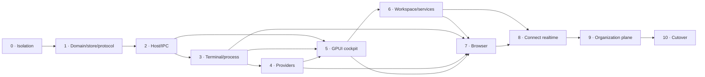

# Native GPUI Session Kernel Program Implementation Plan

> **For agentic workers:** REQUIRED SUB-SKILL: Use superpowers:subagent-driven-development (recommended) or superpowers:executing-plans to implement this plan task-by-task. Steps use checkbox (`- [ ]`) syntax for tracking.

**Goal:** Replace the current window-owned DevManager runtime with one durable Rust session kernel, one native GPUI Task Cockpit, provider-native subscription sessions, task-owned resources, realtime Connect clients, and a clean deletion-based cutover.

**Architecture:** One long-lived `devmanager-host` process owns task facts, SQLite, PTYs, complete process trees, providers, browser contexts, files, Git, services, and Connect synchronization. The native GPUI desktop and web/mobile clients send versioned commands and consume snapshots plus ordered events; no presentation client owns execution. Implementation is divided into independently reviewable phase plans because the approved design spans several subsystems and repositories.

**Tech Stack:** Rust 1.94.0, GPUI 0.2.2, gpui-component 0.5.1, Tokio, MessagePack via `rmp-serde`, SQLite via rusqlite 0.40.1, UUID 1.24.0, portable-pty, alacritty_terminal, WebView2/Wry, React 18/TypeScript/Vite for web clients, Node 24 for DevManager web and Node 22 for Portal, Express/Sequelize/PostgreSQL for the proprietary Connect control plane.

## Global Constraints

- Desktop UI is native GPUI only; do not add Tauri, Electron, React, DOM, or an embedded web shell to the desktop.
- Keep one Rust application package. Phase 8 may add only the narrowly scoped `connect-crypto` Rust/WASM leaf after its dual-target proof demonstrates that one shared security implementation is safer than divergent native/browser code; this does not authorize a general workspace split.
- Ship one desktop architecture. Development may use a separately named preview binary/profile, but no old/new runtime switch or compatibility mode may ship.
- `config.json` and `remote.json` remain supported durable contracts. The new runtime starts with an empty SQLite task database and never reads `session.json`.
- Do not add a one-time session or provider-conversation importer.
- Claude Code, Codex, and Cursor use the user's stock authenticated subscription CLIs. DevManager must not implement their planner, tool loop, retries, compaction, or provider-native subagent scheduler.
- One provider runtime feeds semantic conversation and raw terminal views. Switching views never launches a second provider process.
- Exact provider resume must fail visibly; never infer identity or silently start fresh.
- Every managed process is Task-owned or Host-owned and is assigned before it executes. External processes are observed but never adopted or killed implicitly.
- Default CPU presentation is whole-machine Task Manager math in `0..=100`; raw core equivalents are diagnostics only.
- All resource, port, quota, update, Git, browser, and management probes execute outside terminal/UI hot paths.
- Provider quota is singleton per provider type, hidden when older than one hour, and never obtained with an API key.
- Pairing identity and invite code survive upgrades; rotation and revocation are explicit actions.
- Raw prompts, responses, terminal, browser, recordings, file bodies, and full diffs remain local/E2E-encrypted by default.
- Treat terminal/OSC/link/clipboard data, provider messages, browser content, filenames/paths, and remote events as untrusted; bound/sanitize them at the receiving boundary and never execute presentation data.
- Every dangerous action re-resolves its target, scope, revision/generation, and caller authority immediately before execution. Remote prompt submission is remote code-execution authority and is granted/labeled accordingly.
- Diagnostics are structured, bounded, redacted, and off hot paths; raw content capture is explicit, local, scoped, and time-limited.
- Development and tests may not touch the installed DevManager process or production `config.json`, `remote.json`, `session.json`, browser data, ports, or credentials.
- Before and after persistence/runtime/process/browser/full-suite gates, verify production `config.json` and `remote.json` hashes plus installed PID/start time.
- Announce long Rust verification before it starts; run the complete library suite as `cargo test --lib -- --test-threads=1`; confirm no test harness, Cargo, rustc, development host, provider, or browser helper remains afterward.
- Use TDD for each behavior: failing focused test, observed failure, minimum implementation, focused pass, then the phase gate.
- Commit each independently reviewable task. Do not push, publish, install, or run the production cutover without explicit user authority.

---

## Program release train

| Phase | Detailed plan | Depends on | Independently testable outcome |
|---|---|---|---|
| 0 | [Isolation and Baseline](2026-08-04-phase-00-isolation-baseline.md) | Approved design | A fail-closed `native-next-dev` environment, production guard, baseline evidence, and deletion ledger |
| 1 | [Domain, Store, and Protocol](2026-08-04-phase-01-domain-store-protocol.md) | 0 | Durable tasks, agents, events, receipts, snapshots, SQLite v1, supported config/remote readers, no session import |
| 2 | [Host, IPC, and Lifecycle](2026-08-04-phase-02-host-ipc-lifecycle.md) | 1 | Long-lived host plus named-pipe client reconnect, resync, detach, crash recovery, and bounded update handshake |
| 3 | [Terminal and Process Supervision](2026-08-04-phase-03-terminal-process-supervision.md) | 2 | Host-owned native terminal and complete Job Object process tree with truthful resources and zero-orphan teardown |
| 4 | [Provider-Native Sessions](2026-08-04-phase-04-provider-native-sessions.md) | 3 | Stock Claude/Codex/Cursor sessions, exact resume, semantic projection, Primary/specialists, and fresh quota summaries |
| 5 | [Native GPUI Task Cockpit](2026-08-04-phase-05-native-gpui-task-cockpit.md) | 2, 3, 4 | Polished native desktop shell, semantic conversation, context dock, raw terminal, preview gallery, and accessibility gates |
| 6 | [Workspace, Git, Services, and Command Center](2026-08-04-phase-06-workspace-git-services.md) | 5 | Project configuration, worktrees, files, diffs, checkpoints, servers, SSH, ports, resources, and operational UI |
| 7 | [Task Browser and LLM Validation](2026-08-04-phase-07-task-browser-validation.md) | 3, 4, 5, 6 | Task-owned WebView2 contexts, browser MCP, desktop attachment, transport-neutral projection, and real provider-controlled proof |
| 8 | [Connect Realtime](2026-08-04-phase-08-connect-realtime.md) | 1–7 | Direct and hosted realtime clients, stable pairing, opaque relay, phone UX, invisible solo handoff, watchers, collaborators |
| 9 | [Organization Control Plane](2026-08-04-phase-09-organization-control-plane.md) | 8 | Accounts/membership, managed tasks, Kanban, manager views, honest analytics, DB/ENV contracts, EvidenceBundle intake |
| 10 | [Cutover, Deletion, and Release](2026-08-04-phase-10-cutover-release.md) | 0–9 | One packaged architecture, old runtime removed, empty task-state start, signed updater continuity, and verified release |

## Dependency graph



Phases are dependency ordered, but tasks inside a phase may run in parallel only when their file ownership and interfaces do not overlap. No phase begins its integration task until every dependency phase gate is green.

## Approved requirement coverage

| Approved requirement | Owning tasks | Release proof |
|---|---|---|
| Development/tests cannot touch daily DevManager | 0.1–0.7 | Production hashes/PID/start time before/after every risky gate |
| Durable local Task facts, clean start, no one-time migration | 1.1–1.8, 10.4 | Empty SQLite v1; `config.json`/`remote.json` direct; `session.json` never opened |
| One Rust host, many detachable/reconnecting clients | 2.1–2.11 | Two-client/CLI soak, crash/replay/resync, explicit full quit |
| Complete owned process trees, Task Manager CPU, blue external ports | 3.1–3.10 | Suspended-assignment proof, accounting comparison, zero Job members |
| Stock subscription Claude/Codex/Cursor and exact resume | 4.1–4.11 | Version fixtures, one-process/two-view, visible exact-resume failure |
| Native GPUI Task Cockpit and major UI/UX replacement | 5.1–5.10 | Preview matrix, keyboard/accessibility, large-data/performance gates |
| Projects/worktrees/files/Git/checkpoints/services/SSH | 6.1–6.10 | Real temporary-repository lifecycle and external-listener safety |
| Browser follows Task and is really LLM-controlled | 7.1–7.11 | Cross-process WebView2 proof plus real stock-provider E2E matrix |
| Realtime desktop/phone with stable pairing and no refresh | 8.1–8.10 | Direct/hosted failure matrix, update without re-pairing, relay opacity |
| Watchers/collaborators and optional central management | 8.8, 9.1–9.10 | Local role enforcement, existing Board reuse, privacy negatives |
| DB/ENV and DevAgent integration without cloud execution authority | 9.8–9.10 | Fake/dev target receipts and cross-repo EvidenceBundle fixtures |
| Rip-and-replace release with no old system beside it | 10.1–10.11 | Source-absence audit, package/update VM matrix, eight-hour soak |

## Selective research adoption

- **tmux:** Phases 2–3 adopt one durable server/many clients, detach/reconnect, canonical terminal state, per-client viewport, stable IDs, and slow-client backpressure; DevManager adds durable Task facts and complete Windows descendant ownership.
- **Pi:** Phase 4 keeps the adapter capability-driven so a documented Pi RPC/provider adapter can be added after the initial Claude/Codex/Cursor release, but Pi does not replace the stock-provider harnesses or define the kernel protocol.
- **T3 Code:** Phases 5–6 adopt Task-first navigation, worktree-by-default coding, changes/review close to conversation, and multi-agent results as inspectable artifacts; its web/Electron harness is not copied into the native desktop.
- **Traycer:** Phases 5, 6, and 9 adopt durable plans/evidence/review/dependency visibility and management-oriented task context selectively. Any code reuse waits for the Phase 9 provenance/license audit, and raw work content stays local/E2E-off by default.
- **Codex/Claude native harnesses:** Phase 4 deliberately delegates planning, tools, retries, compaction, approvals, and provider-native child agents to the continuously improved stock CLIs. DevManager owns lifecycle, identity correlation, projection, resources, and explicit cross-provider artifact handoff only.

## Cross-phase source map

The paths below are locked for the replacement. Temporary re-exports may keep the development checkout compiling, but every temporary seam must appear in the deletion ledger and be gone in Phase 10.

```text
src/
  main.rs                         Native GPUI product entry after cutover
  bin/
    devmanager-host.rs            Durable host entry
    devmanager-next.rs            Development-only GPUI entry; deleted at cutover
  config/
    mod.rs                        Supported config.json/remote.json facade
    model.rs                      AppConfig/Project/Folder/Command/SSH settings
    paths.rs                      Profile-aware paths and production fail-closed rules
    project_store.rs              Atomic config.json reader/writer
    remote_store.rs               Atomic remote.json reader/writer
  domain/
    mod.rs                        Domain exports
    id.rs                         Stable typed UUID identifiers
    task.rs                       Task facts/lifecycle/status derivation
    agent.rs                      Agent/provider identities and roles
    artifact.rs                   Artifact metadata and content references
    resource.rs                   Terminal/process/browser/service ownership facts
    command.rs                    Versioned mutation intents
    event.rs                      Append-only domain events
    snapshot.rs                   Client read models
  kernel/
    mod.rs                        Kernel public API
    schema.rs                     SQLite migrations and integrity checks
    store.rs                      Events/projections/receipts/outbox transaction
    command_bus.rs                Per-task sequencing and invariant checks
    projector.rs                  Deterministic read projections
    outbox.rs                     Side-effect dispatch/reconciliation
    runtime.rs                    Live resource registries and generation fences
  protocol/
    mod.rs                        Wire exports and version constants
    capabilities.rs               Negotiated feature set
    envelope.rs                   Commands/responses/events/snapshots
    frame.rs                      Bounded length-prefixed MessagePack
    crypto.rs                     Connect inner-frame authenticated encryption
  host/
    mod.rs                        Host bootstrap
    lock.rs                       One host per profile
    ipc.rs                        Per-user named-pipe server
    connection.rs                 Client subscriptions/backpressure/resync
    shutdown.rs                   Detach versus full quit
    update.rs                     Bounded host/client update handoff
  client/
    mod.rs                        Shared client connection facade
    connection.rs                 Reconnect and request correlation
    model.rs                      Snapshot/event client projection
    subscription.rs               Cursor, snapshot, replay, and resync state
    action.rs                     One capability-aware action catalog for every client
    cli.rs                        JSON/stdin/stdout `devmanager-host ctl` client
  process/
    mod.rs                        Process service exports
    identity.rs                   PID plus creation identity
    job.rs                        Windows Job Object ownership/notifications
    launcher.rs                   Suspended launch, assign, resume
    registry.rs                   Task/Host/External classification
    sampler.rs                    Whole-machine CPU/memory/process tree samples
    ports.rs                      Managed/external listener projection
    teardown.rs                   Graceful stop/escalation/zero-member proof
  terminal/
    session.rs                    Host-owned PTY plus canonical terminal state
    protocol.rs                   Terminal commands/snapshots/deltas
    service.rs                    Terminal registry and generation fencing
    replica.rs                    Replaceable-client terminal replica
    view.rs                       GPUI renderer only
  providers/
    mod.rs                        Provider registry
    adapter.rs                    Small object-safe stock-CLI contract
    registry.rs                   Executable discovery and adapter registry
    capabilities.rs               Cached binary/version/auth probes
    session.rs                    One supervised provider runtime
    journal.rs                    Common semantic event vocabulary
    input.rs                      Send/steer/follow-up/answer/approval sequencing
    orchestrator.rs               Primary/specialist bounded artifact handoff
    claude.rs                     Claude Code launch/hooks/resume
    codex.rs                      Codex launch/hooks/resume
    cursor.rs                     Cursor Agent launch/stream/hooks/resume
    quota.rs                      One background quota probe per provider kind
  workspace/
    model.rs                      Task workspace contracts
    service.rs                    Workspace binding and project behavior
    worktree.rs                   Main/Worktree/Ask policy and cleanup
    files.rs                      Bounded file access
    artifacts.rs                  Content-addressed Task artifacts
    checkpoint.rs                 Before/after manifests and targeted restore
  git/
    model.rs                      Git read models and fingerprints
    command.rs                    Serialized status/mutation executor
    checkpoint.rs                 Git-aware checkpoint implementation
    review.rs                     Diff comments, commit/push/PR actions
  ssh/
    launch.rs                     SSH launch specification
    credentials.rs                Local secret materialization and cleanup
  browser/
    domain.rs                     Task/context/tab identities and facts
    host/                         Host-owned WebView2 lifecycle and attachment
    protocol.rs                   Browser commands/events/snapshots
    service.rs                    Task browser registry/generation fencing
    surface.rs                    Host-owned WebView2 child surface attachment
    projection.rs                 Desktop/Connect browser projections
    mcp.rs                        Task-scoped provider browser tools
  connect/
    mod.rs                        Host-side Connect client
    model.rs                      Connect wire/session identifiers
    direct.rs                     Direct authenticated WebSocket transport
    relay.rs                      Outbound opaque relay connection
    identity.rs                   Persistent invite/device/host identity
    crypto.rs                     Fixed Noise channel implementation
    session.rs                    Reconnect/replay/backpressure state
    permissions.rs                Local/guest/organization authorization
    presence.rs                   Ephemeral solo/collaboration presence
    projection.rs                 Metadata/raw visibility filtering
    managed.rs                    Opt-in BoardCard/organization linkage
    telemetry.rs                  Bounded management observations
    local_actions.rs              DB/ENV local execution contract
    evidence.rs                   DevAgent EvidenceBundle intake
  diagnostics/
    logging.rs                    Structured bounded redacted host diagnostics
  ui/
    mod.rs                        GPUI application bootstrap
    tokens.rs                     Visual tokens
    components/                   DevManager semantic primitives
    actions.rs                    UI bindings to client action registry
    preview.rs                    Seeded visual QA modes
    shell.rs                      Global navigation/header/layout
    task_cockpit/                 Task list/header/timeline/composer/context dock
    command_center/               Hosts/processes/services/resources
    configuration/                Project/settings/connections forms
crates/
  connect-crypto/                 Phase 8-only shared native/WASM Noise core after proof gate
```

The current `src/app`, `src/state`, `src/models`, `src/sidebar`, old `src/workspace` UI, old remote snapshot bridge, and archived Tauri tree remain reference/compilation dependencies only until their replacements pass. Phase 10 deletes them; no same-purpose second implementation remains after release.

## Stable cross-phase interfaces

Later plans must use these names. If implementation evidence requires changing one, update this roadmap and every dependent plan in the same commit.

```rust
pub struct CommandEnvelope {
    pub command_id: CommandId,
    pub client_id: ClientId,
    pub task_id: Option<TaskId>,
    pub issued_at_ms: i64,
    pub expected_task_revision: Option<u64>,
    pub command: Command,
}

pub enum CommandReceipt {
    Accepted {
        command_id: CommandId,
        task_revision: u64,
        event_ids: Vec<EventId>,
    },
    Rejected {
        command_id: CommandId,
        code: RejectionCode,
        current_revision: Option<u64>,
    },
}

pub enum ServerMessage {
    Hello(ServerHello),
    Receipt(CommandReceipt),
    Snapshot(KernelSnapshot),
    Events(EventPage),
    Stream(StreamFrame),
    ResyncRequired { scope: ResyncScope, reason: ResyncReason },
    Error(ProtocolError),
}

pub struct StreamFrame {
    pub subscription_id: SubscriptionId,
    pub stream: StreamKey,
    pub generation: u64,
    pub sequence: u64,
    pub payload_kind: StreamPayloadKind,
    pub schema_version: u16,
    pub payload: Vec<u8>,
}

#[async_trait::async_trait]
pub trait ProviderAdapter: Send + Sync {
    fn kind(&self) -> ProviderKind;
    async fn probe(&self, executable: &Path) -> Result<ProviderCapabilities, ProviderError>;
    fn build_launch(&self, request: LaunchProviderRequest) -> Result<ProviderLaunchSpec, ProviderError>;
    fn parse_signal(&self, signal: ProviderSignal) -> Vec<JournalEvent>;
    fn cooperative_stop(&self, session: &ProviderRuntime) -> StopStrategy;
    async fn observe_quota(&self, executable: &Path) -> Result<Option<QuotaObservation>, ProviderError>;
}

pub struct TerminalService {
    // Host-owned registry; no UI types.
}

impl TerminalService {
    pub async fn create(&self, owner: TaskId, spec: TerminalSpec) -> Result<TerminalId, TerminalError>;
    pub async fn write(&self, id: TerminalId, input: InputEnvelope) -> Result<InputAck, TerminalError>;
    pub async fn resize(&self, id: TerminalId, size: TerminalSize) -> Result<(), TerminalError>;
    pub async fn snapshot(&self, id: TerminalId) -> Result<TerminalSnapshot, TerminalError>;
    pub async fn close(&self, id: TerminalId, reason: CloseReason) -> Result<TeardownReport, TerminalError>;
}
```

## Phase execution contract

Each detailed plan follows this sequence:

1. Confirm dependencies and the previous phase gate.
2. Capture a fresh production-isolation baseline.
3. Run the focused pre-change test and record whether it is green.
4. Add one failing test for one behavior.
5. Observe the intended failure; a compile error unrelated to the intended missing behavior does not count.
6. Implement the minimum coherent behavior.
7. Run the focused test and adjacent regression tests.
8. Review the complete task diff and correct it once.
9. Commit the task with only its owned paths.
10. At phase end, run the full documented gate once, verify production isolation, and confirm zero development/test descendants.

## Mandatory evidence bundle per phase

Store local evidence under the ignored phase directory `.devmanager-next/evidence/phase-XX/`:

```text
baseline.json                 Production hashes/PID/start time before work
verification.json             Commands, exit codes, durations, pass/fail counts
processes-before.json         Development-owned process inventory
processes-after.json          Must contain zero live disposable members
performance.json             Metrics required by that phase
screenshots/                 UI/browser evidence when applicable
notes.md                     Only deviations and resolved failures
```

The commit contains tests and durable documentation, not machine-specific PIDs, paths containing secrets, provider transcripts, credentials, or raw user work.

## Program-wide stop conditions

Stop the current phase and correct the architecture before continuing if any of these occur:

- a test or development binary resolves to the production profile;
- the installed DevManager PID/start time changes;
- production `config.json` or `remote.json` changes;
- a second provider process appears for one agent/runtime generation;
- a managed process escapes its Job Object or remains after verified teardown;
- the desktop directly mutates execution state instead of sending a command;
- a provider update prevents the stock terminal from launching;
- exact resume silently starts a new conversation;
- browser automation can target another task's context;
- remote state requires manual refresh;
- the relay can read a raw encrypted payload;
- UI interaction leaks through to a newly focused terminal;
- a phase introduces a permanent compatibility/dual-write path;
- the full replacement cannot delete an old same-purpose module.

## Final definition of done

The program is complete only when Phase 10 proves all of the following in the packaged release:

- `DevManager.exe` is the only desktop shell and is native GPUI.
- `devmanager-host.exe` is the sole execution authority.
- closing/updating the desktop does not interrupt host-owned tasks.
- one stock provider runtime backs both semantic and terminal views.
- task/session/process identities are explicit and generation fenced.
- all process trees and browser resources terminate with zero orphans.
- Task Manager CPU math, external-port blue state, quota freshness, updater discovery, and stable pairing work as specified.
- the real LLM-controlled browser passes the visible end-to-end suite.
- desktop and phone alternate commands in realtime without refresh or control ceremony.
- watcher/collaborator/organization authorization is enforced by the host.
- raw content is local/E2E-private by default.
- `config.json` and `remote.json` survive; old `session.json` is ignored.
- old runtime/UI/remote compatibility code, legacy fixtures, and `zz-archive/tauri-react-v0.1.11` are absent.
- signed installers contain both required Rust binaries and updates do not rotate pairing identity.
