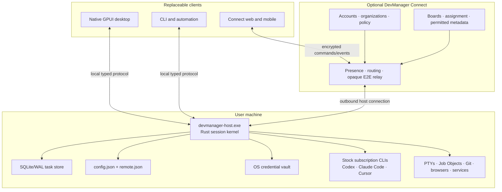

# DevManager Native GPUI Session Kernel and Connect Design

**Status:** Approved product direction; selective-adoption revision awaiting written-spec review

**Date:** 2026-08-04

**Supersedes:** The Tauri/WebView desktop recommendation explored during brainstorming

## Decision summary

DevManager will be rebuilt around one local-first Rust session kernel and one native GPUI desktop client. This is a clean replacement, not a second UI layered over the current application.

The approved decisions are:

- The desktop is native GPUI throughout.
- The existing native terminal path remains: `portable-pty -> alacritty_terminal -> GPUI`.
- The Task Cockpit is the primary product model. Projects organize work; durable tasks own conversations, provider sessions, workspaces, terminals, services, browsers, artifacts, and review state.
- The Rust host is the sole local execution authority. Desktop, Connect, mobile, CLI, and automation are clients of the same typed command/event contract.
- Claude Code, Codex, and Cursor remain official subscription-backed runtimes. Their own harnesses retain planning, tools, approvals, retries, compaction, and native subagents.
- A task normally has one Primary provider. Optional specialists are explicit, bounded, and isolated. DevManager coordinates artifacts and resources; it does not implement a model-control loop.
- Semantic conversation and raw terminal are two native views of the same live provider session, never two provider processes.
- DevManager Connect is an optional hosted product and realtime transport. It never becomes the execution authority and cannot decrypt raw task content by default.
- Organization accounts and management features may live in Connect. Personal work remains local-only unless deliberately enrolled.
- DevManager selectively adopts proven infrastructure patterns from Oh My Pi around compatibility testing, bounded protocols, semantic rendering, lifecycle cleanup, and collaboration. It does not embed or fork Oh My Pi's model harness.
- Saved prompts are durable, versioned local assets. Prompt chains are visible manual sequences, not an automation engine. Organization prompts are deliberately published through Connect and execute locally through the stock provider CLIs.
- The replacement starts with no open tasks, terminals, or provider conversations. There is no one-time session migrator.
- Existing left-sidebar project configuration and paired-device identity remain supported durable formats. Reusing those formats is the new system's contract, not legacy compatibility.
- The old desktop runtime, old UI paths, `session.json` loader, and compatibility shims are removed at cutover. No old/new runtime feature flag ships.

## Product goals

1. Make a coding task durable independently of any window, PTY, provider process, or client connection.
2. Make local desktop use feel as immediate and reliable as a first-class native terminal.
3. Make the same task available in realtime from desktop, phone, browser, CLI, and later native mobile clients.
4. Keep provider subscriptions and official provider harnesses authoritative so upstream improvements arrive without recreating them in DevManager.
5. Guarantee complete ownership, accounting, and teardown of every process DevManager starts.
6. Make browser automation visible, task-scoped, testable, and free of orphaned browser helpers.
7. Deliver a coherent, accessible UI system rather than continuing one-off GPUI styling.
8. Support optional team management without making personal work cloud-dependent or exposing raw work by default.
9. Keep the architecture small enough for a small team to own: one local kernel, one protocol, one desktop UI, and narrow provider adapters.

## Explicit non-goals

- No Tauri, Electron, React, or DOM-based desktop shell.
- No second desktop rendering stack.
- No custom planner, agent loop, context compactor, retry strategy, or generic model router.
- No API-key billing path masquerading as subscription use.
- No silent fallback from an exact provider resume to a new conversation.
- No concurrent autonomous writers in one working tree.
- No cloud execution of local terminals, services, browsers, Git operations, or provider credentials.
- No raw prompts, responses, terminal output, browser content, recordings, file bodies, or full diffs in Connect by default.
- No claim that arbitrary processes can be resurrected after a host reboot.
- No indefinite old-schema readers, dual writes, legacy desktop mode, or old/new runtime switch.
- No attempt to port an entire upstream product or terminal implementation when a narrow adapter or independently implemented invariant is sufficient.
- No embedded or forked Oh My Pi harness, unrestricted in-host plugin runtime, or alternate provider-control loop.
- No DevManager agent bus, recursive cross-provider scheduler, YAML/DAG swarm engine, or attempt to reserve capacity for provider-native child agents that the stock CLI does not expose.
- No automatic execution, branching, conditions, or completion workflow in prompt chains.
- No emotion, sentiment, profanity, blame, repetition, or inferred worker-behavior scoring from user or provider text.

## System boundary



The two local executables are parts of one product, not competing systems:

- `devmanager-host.exe` is the long-lived owner of durable state and local work.
- `DevManager.exe` is the native GPUI presentation client. Closing or updating it detaches the view without terminating tasks.

The host may start on demand and remain alive while it owns open tasks or configured services. An explicit **Quit DevManager Completely** action drains or stops owned resources according to policy and then exits the host. Closing a window is only a detach.

## One authority and one protocol

Every mutating operation follows the same route regardless of where it originated:

```text
client intent
  -> typed command { request_id, client_id, expected_revision }
  -> authorization and invariant checks
  -> per-task serialized command queue
  -> one durable transaction, idempotency receipt, and side-effect outbox
  -> Accepted { request_id, operation_id, revision }
  -> bounded side effect
  -> Settled or Failed event correlated to operation_id
  -> projections pushed to every subscribed client
```

Buttons, keyboard shortcuts, the command palette, Connect, CLI automation, and provider-facing tools all invoke the same action registry. UI code never reaches around the kernel to mutate process, task, Git, browser, or provider state.

The protocol includes:

- stable opaque IDs rather than mutable names or sidebar positions;
- request IDs and idempotent receipts;
- monotonically ordered event sequence numbers;
- snapshots plus cursor-based replay;
- explicit runtime generations so late output from replaced processes is rejected;
- bounded queues and priority lanes;
- wire-version and capability negotiation independent of marketing version numbers;
- negotiated limits for physical frames and fully reassembled messages;
- chunking and cursor pagination for snapshots, transcripts, artifacts, and other large payloads;
- an explicit forced-resync response when a client is too far behind;
- closed error codes plus safe user-facing context;
- safe handling of unknown future frames and events without inventing domain facts;
- schema fixture tests for every shipped client.

Interactive traffic such as keystrokes, send, stop, answers, and approvals pre-empts screenshots, scrollback, diffs, and file transfers. A slow remote client can lose transient progress and receive a fresh snapshot; it must never stall a provider PTY or the host.

Command acceptance and operation settlement are different facts. An `Accepted` receipt means the command passed authorization, was durably recorded, and will be attempted once; it does not claim that a provider started, a process stopped, or an artifact finished. Long-running effects settle through a correlated success or failure event and remain queryable by operation ID after a client reconnects. Pure in-database commands may be accepted and settled in one transaction while preserving the same public semantics.

No client sends or receives one unbounded history frame. The peers negotiate conservative physical-frame and reassembled-message limits at connection time. Large state is chunked with item and byte bounds, checksummed where integrity matters, and resumable from a cursor. Exceeding a declared limit returns a closed protocol error rather than allocating until failure.

Capability negotiation is not a legacy desktop mode. It is the bounded wire contract required for independently reconnecting clients and in-progress desktop updates. Unsupported features remain unavailable with an explicit explanation. The product will not carry alternate domain models or unbounded historical protocol implementations.

## Durable domain model

### Identity hierarchy

```text
Environment
  Project
    Task
      AgentSession
        ProviderRuntimeGeneration
      WorkspaceBinding
      Terminal
      ManagedService
      BrowserContext
      Artifact
      ReviewState
```

Each identity has one meaning:

- **Environment ID:** one installed host and its capabilities.
- **Project ID:** durable user configuration for a workspace and its commands.
- **Task ID:** the product-level unit of work shown in Inbox, Running, Needs Me, Ready, and Recent.
- **Agent Session ID:** one conversation role within a task, such as Primary or Security Review.
- **Provider Session ID:** the exact identity assigned by Claude Code, Codex, or Cursor.
- **Runtime Generation:** one concrete launch or resume attempt for an agent session.
- **Terminal ID:** one durable terminal projection attached to a task.
- **Process Identity:** PID plus OS creation identity, never PID alone.
- **Client ID:** one desktop, phone, browser, CLI, or automation client.

Cwd, timestamps, transcript order, tab order, process names, and PIDs alone never substitute for explicit identity.

### Task contents

A task owns:

- title, description, lifecycle, project, and assignment;
- one Primary agent session and zero or more optional specialist sessions;
- workspace root or isolated worktree bindings;
- conversation messages, supported tool events, questions, approvals, and user-visible summaries;
- PTYs, process trees, managed services, ports, and resource samples;
- controlled browser contexts, tabs, screenshots, recordings, and automation activity;
- files, diffs, checkpoints, commits, reviews, and pull-request references;
- artifacts such as specifications, findings, decisions, evidence bundles, and review reports;
- authorized clients, guests, organization policy, and content-sharing classifications.

### Facts and derived state

The kernel stores facts, not a second collection of UI badges. Visible state is derived using this precedence:

1. Host or required runtime disconnected
2. Failed
3. Needs approval
4. Needs answer
5. Working or settling
6. Ready for review
7. Idle

Lifecycle (`Open`, `Archived`), connectivity, attention, and activity remain separate axes. Status colors always have icons and text; color alone is never the meaning.

### Lifecycle promises

The UI uses precise language for four different guarantees:

- **Detach:** a client closes; the host and live work continue.
- **Reconnect:** a client restores subscriptions from an event cursor or snapshot.
- **Resume:** a new provider process resumes one exact provider conversation ID.
- **Recover:** after host loss or reboot, DevManager restores metadata, scrollback, and restart recipes. It does not pretend arbitrary processes remained alive.

### Task lifecycle

1. **Create:** resolve project policy and choose main workspace, isolated worktree, or an explicit prompt.
2. **Bind:** start a new provider session or resume an exact known provider identity.
3. **Turn:** checkpoint relevant files, submit now, steer the active turn, or queue a follow-up.
4. **Attend:** persist questions and approvals and push them to every authorized client.
5. **Settle:** wait for provider completion, lifecycle hooks, checkpoint finalization, and durable events before showing Ready.
6. **Review:** inspect diff, artifacts, comments, tests, browser evidence, commit, push, or open a pull request.
7. **Close:** terminate disposable task resources, verify cleanup, remove the task from open work, and retain its new-system history.

## Persistence and the clean cutover

### Durable configuration that remains

The replacement directly supports the current durable project/sidebar configuration in `config.json`. It becomes the initial version of the new configuration contract; it is not loaded through a deprecated adapter and is not dual-written.

The replacement also directly supports the current device identity, pairing secret, long-lived device pairing code (the current invite code), and authorized-device records in `remote.json`. Application upgrades must not rotate that pairing code or invalidate a previously paired device. Rotation and revocation are explicit user actions.

Both files use atomic replacement, validation before activation, and recoverable backups as ordinary persistence safety—not migration machinery.

### State that deliberately starts fresh

The first replacement launch creates an empty task database. It does not import:

- open tabs;
- terminal scrollback;
- transient processes or services;
- old provider conversation IDs;
- old runtime state;
- old browser tabs;
- old `session.json` contents.

The new kernel never reads `session.json`. Once the replacement is validated, the old session loader, fixtures, and compatibility tests are deleted.

### New durable store

New task state uses one SQLite database in WAL mode with:

- append-only domain events;
- transactional read projections;
- idempotency receipts;
- a durable side-effect outbox;
- explicit schema migrations for the new system from version 1 onward;
- integrity checks and bounded compaction/retention jobs;
- no provider credentials or Connect private keys.

Schema migrations inside the new system are normal long-term maintenance. There is no migration from the old tab/session representation into the new task representation.

Secrets live in the OS credential vault. Logs and diagnostics refer to secret handles, never secret values.

## Prompt library and guided prompt chains

The prompt library is part of the local task product, but it is not provider memory and does not replace provider-native slash commands.

Three surfaces remain distinct:

- **Saved prompts:** durable user-authored templates with metadata and immutable versions.
- **Recent prompt history:** searchable prompts the user actually submitted, retained under an explicit local retention policy.
- **Provider commands:** live slash commands and other controls discovered from the active stock CLI.

The host SQLite database is authoritative for personal saved prompts, versions, ordered chains, and recent history. Local full-text search may use SQLite FTS. History indexing and retention writes are deferred and batched outside input, PTY, and render hot paths.

A prompt has a stable ID, title, optional description/tags, an immutable version sequence, and a current-version pointer. The UI shows a readable diff between versions. A chain is only an ordered list of links to exact prompt versions. Users can add any number of links, see previous and next prompts, insert a link between two existing links, reorder or remove links, and explicitly update a link to a newer prompt version.

Using a chain is deliberately manual. **Put in composer** copies the selected version into the current task composer, where the user can edit and send it normally. Sending does not automatically advance, execute another prompt, evaluate a condition, branch, or mark a workflow complete. The chain simply makes the recommended next prompt and surrounding sequence easy to understand.

Paired remote clients access the owning host's personal library through the existing end-to-end encrypted Connect channel. This does not create a cleartext Connect copy or cross-host replication system. Cross-host personal prompt replication is deferred until it can reuse the ordinary Connect content envelope without a prompt-specific crypto or conflict-resolution subsystem.

Organization prompts are a separate Connect-authoritative publishing surface. Maintainers publish an exact immutable version, may supersede or deprecate it, and can place published versions in shared manual chains. Publication is an explicit decision to share that prompt with the organization under its access and retention policy. Execution still occurs locally through the user's authenticated stock CLI; Connect never becomes a model harness. Published organization prompts use the existing Connect authorization and encrypted transport rather than a prompt-specific cryptographic protocol.

## Provider-native architecture

### Universal provider contract

Each provider adapter implements a small capability-driven contract:

- detect whether the stock CLI is installed;
- detect provider version and authenticated subscription status using supported commands;
- launch the user's configured stock command in one supervised runtime;
- capture a provider session ID only from an official, correlated event for the current runtime generation;
- resume only an exact provider session ID;
- accept user prompt, steer, follow-up, answer, approval, interrupt, and close operations when the provider advertises them;
- emit supported semantic messages, tool events, approvals, questions, usage, child-agent lineage, and terminal bytes;
- expose the real raw terminal at all times;
- report capability loss without preventing the stock terminal from launching.

The adapter does not own prompts beyond explicit user or Primary handoffs, planning, tool selection, retries, context compaction, subagent scheduling, or model reasoning.

### One process, two views

The provider runtime is launched once. Its PTY/control channel and official lifecycle events feed two GPUI projections:

- **Conversation:** native semantic messages, tools, questions, approvals, progress, files, and artifacts.
- **Terminal:** the canonical native terminal grid and scrollback for the same runtime generation.

Switching views never starts, resumes, or replays a provider. Conversation input is delivered to the same official runtime through a supported control method or its PTY input path. Raw terminal input and Task Cockpit actions pass through the same per-session input sequencer so a sidebar click can never leak through as a terminal choice.

### Fail-open compatibility

The launch path is deliberately simpler than the semantic enhancement path:

- A provider update that changes optional event output may reduce the session to **Terminal only**.
- It must not prevent the user's configured stock CLI from opening.
- Unknown events are retained only as bounded safe diagnostics; they do not invent task state.
- Unknown or malformed semantic events render through a bounded generic fallback instead of disappearing or crashing the task view.
- Exact resume remains strict. If the provider rejects the known ID, DevManager shows the failure and offers an explicit new-session action.
- Capability probes run outside startup and input hot paths and are cached by binary path plus version.
- Adapters target documented hooks, commands, and protocols. Private transcript scraping is diagnostic-only and never canonical.

Codex initially remains the stock CLI with its supported hooks. DevManager will not restore a proxy architecture that launches a second Codex process or changes native `/resume` behavior. Claude Code remains its stock CLI/PTY plus supported hooks. Cursor uses its stock authenticated CLI and advertised stream/hooks/resume capabilities. Pi may later use its documented RPC mode as another provider adapter; it does not dictate the kernel protocol.

DevManager's append-only task events, semantic projections, and agent-lineage facts describe DevManager activity; they are not a reconstructed provider context tree. The provider session ID captured from the correlated current runtime generation remains the sole exact-resume key. DevManager never guesses, rewrites, forks, or claims ownership of the provider's private conversation context, and a failed exact resume never silently becomes a fresh session.

Within the new system, an open agent session resumes its exact previous provider conversation by default whenever its runtime must be recreated. Provider actions are named **Stop turn**, **Close agent**, **Resume**, and **Start new conversation**. A generic server-style **Restart** action is not shown for an agent.

### Primary and specialists

A new task creates one Primary agent and hides agent hierarchy until another agent exists.

The Primary owns the user-facing synthesis and integration. Its native harness may create its own provider-native child agents without DevManager reproducing that logic. DevManager records parent, child, provider, role, status, transcript reference, artifacts, resource use, and provider-reported usage only when the stock harness exposes those facts. When exact child identity is unavailable, the Task Cockpit shows truthful aggregated activity rather than fabricating a child conversation.

A cross-provider specialist is exceptional and explicit:

1. The user or Primary requests a bounded role and outcome.
2. The kernel applies provider preference, concurrency, permission, duration, and workspace policy.
3. A stock subscribed provider runtime performs the work.
4. The specialist returns a `SpecialistResult` envelope containing its role, status, summary, evidence references, produced artifacts, workspace/commit facts, and any requested follow-up.

The envelope is validated when the provider can produce reliable structured output. A bounded raw artifact remains the truthful fallback when a stock CLI cannot guarantee that shape; DevManager never invents missing structured fields. Cross-provider specialists are read-only by default. A writable specialist receives an isolated worktree. No two autonomous agents write to the same worktree, no specialist recursively starts another cross-provider specialist in the initial release, and DevManager does not copy entire private transcripts between providers.

Automatic cross-provider delegation is off by default because it consumes another subscription quota and starts another supervised runtime. A user may enable bounded automatic **read-only** specialists per project or task. Writable access, a new permission boundary, or a provider not already allowed by that policy always requires explicit approval.

Concurrency policy applies only to top-level provider runtimes that DevManager launches. A provider's opaque native children remain inside that provider runtime and Job tree. DevManager neither reserves speculative capacity for them nor holds a top-level capacity slot merely because a parent is waiting on a native child. If a provider exposes independently addressable child runtimes in the future, the adapter must first prove their identity and lifecycle semantics before they can become separately scheduled resources.

The bridge uses MCP ingress and A2A-aligned task/message/artifact/status semantics where useful, but remains a thin local task handoff. It is not a universal DevManager agent harness.

## Native GPUI presentation architecture

### One desktop design system

The new desktop shell uses GPUI and a curated subset of `gpui-component` behind DevManager-owned semantic component interfaces. Feature modules do not directly depend on arbitrary third-party widget details.

The design system includes:

- semantic color, typography, spacing, radius, elevation, motion, and density tokens;
- accessible light, dark, and system themes;
- WCAG AA contrast targets;
- keyboard focus, screen-reader labels where GPUI supports them, reduced motion, and zoom/scaling behavior;
- reusable buttons, menus, dialogs, command palette, fields, cards, lists, trees, tabs, docks, splitters, banners, progress rows, tables, Markdown, code blocks, diffs, and status indicators;
- seeded component and full-screen preview states for visual review without launching real providers;
- no feature-local color constants or ad hoc interaction rules.

Native UI does not mean terminal-shaped UI. Messages, tools, approvals, questions, diffs, and browser activity are semantic GPUI components. The raw terminal remains a first-class native mode one action away.

### Semantic renderer registry

Provider adapters normalize supported output into a small provider-neutral event/card contract. A renderer registry maps known semantic kinds to specialized GPUI components for messages, tools, questions, approvals, plans, diffs, files, browser actions, usage, agents, and artifacts. Every entry has stable identity, ordering, lifecycle, accessibility text, and a bounded plain-data representation.

Unknown, newly introduced, or malformed provider events use a safe generic renderer that shows source, status, title, and bounded redacted details. It never interprets unknown data as an approval, question, completed operation, or task-state transition. The user can always switch to the raw terminal for the exact provider surface.

The native desktop and Connect web client consume the same semantic contract. Rust protocol definitions and golden fixtures are authoritative; generated bindings or fixture-verified decoders prevent a separately hand-maintained TypeScript meaning from drifting. Presentation is client-native, but semantics, fallbacks, and ordering are shared.

### Desktop anatomy: Task Cockpit

The desktop has four stable regions:

1. **Navigation rail**
   - Inbox, Running, Needs Me, Ready, Recent
   - projects and their configured items
   - Command Center, Connections, and Configuration
2. **Task header**
   - title, project/worktree/branch, activity, Primary provider/model, permission mode, stop/close actions
   - Connect state and fresh provider quotas in the global strip
3. **Conversation surface**
   - messages, collapsed tool activity, questions, approvals, queued follow-ups, attachments, and composer
4. **Context dock**
   - Changes, Files, Terminal, Browser, Services, Artifacts, and Review

The dock is resizable and may be hidden, but DevManager does not become an arbitrary pane-layout editor. The task remains visually primary.

### Mobile and Connect anatomy

Connect presents the same task and command model using responsive web views. On a phone, Chat, Changes, Files, Terminal, Browser, Services, and Artifacts become full-screen modes rather than miniature desktop panes. Per-client view state includes selected mode, scroll position, dock width, expansion state, and draft.

Drafts are device-local by default. An explicit handoff may copy a draft. A reconnect never overwrites one device's draft with another's.

### Input safety

Switching tasks, clicking the sidebar, restoring focus, closing an overlay, or activating a tab is consumed by the UI event that performs that action. It cannot also become a pointer event, key, newline, or menu selection inside the newly focused terminal.

The terminal accepts input only after:

- it was focused before the current pointer/key gesture, or
- a distinct subsequent gesture targets the terminal.

Questions and approvals use semantic controls outside the terminal whenever official provider events expose them. The first accepted answer wins by request ID; duplicate answers return `AlreadyResolved` and can never fall through as terminal input.

### Command Center

The Task Cockpit remains the daily coding surface. Command Center is a separate operational view for hosts, tasks, services, ports, provider runtimes, resources, and failures. This retains operational visibility without making every task screen dense.

## Terminal architecture

The kernel owns each PTY and canonical terminal state. GPUI renders the grid using the current Alacritty terminal model. Remote clients receive bounded snapshots/deltas or a provider semantic projection; they do not become PTY owners.

Terminal requirements include:

- ANSI/VT correctness, Unicode, wide characters, combining characters, cursor modes, alternate screen, mouse reporting, bracketed paste, clipboard policy, selection, copy mode, search, IME, resize, DPI, and long scrollback;
- independent client viewport and scroll position;
- PTY reads that never block on a slow renderer;
- bounded scrollback and explicit truncation markers;
- full resync after dropped deltas;
- separate actions for detach client, close terminal, interrupt foreground work, and terminate the entire managed tree.

The kernel never treats a terminal's direct child PID as the complete process inventory.

## Process ownership and resource accounting

### Ownership classes

Every observed process or listening service is classified as exactly one of:

- **Task-owned:** created for one task and terminated with its disposable resources.
- **Host-owned:** shared DevManager infrastructure with an explicit lifecycle.
- **External:** not launched by DevManager; observed but never killed by DevManager.

`Unknown` or `untracked` is a fault requiring reconciliation, not a fourth steady state.

### Windows launch and teardown

Every managed Windows process follows this sequence:

1. Create suspended so no child code runs before ownership is attached.
2. Assign it to the task or host Job Object.
3. Record PID plus process creation identity and runtime generation.
4. Resume execution.
5. Consume job notifications for lifecycle changes outside the UI hot path.
6. On stop, request graceful interruption and allow a bounded drain.
7. Escalate by terminating the entire Job tree.
8. Verify the Job has zero members, close IPC/PTY/browser handles, and reconcile previously owned ports.

Unexpected detached descendants, PID reuse, an unowned provider child, or a supposedly closed task still consuming resources produces a visible health fault and diagnostic evidence.

Unix backends later use process groups, sessions, or cgroups with the same public semantics.

### Closing admission barrier

Close is a durable lifecycle operation, not a sequence of best-effort UI callbacks. Its first step atomically moves the target to `Closing`, advances its action epoch/runtime generation as applicable, and rejects new launches, sends, browser commands, background jobs, and side-effect retries. Previously accepted operations either settle within their bounded drain policy or are cancelled with an explicit result.

Teardown is idempotent and proceeds in dependency order:

1. stop admission and publish `Closing`;
2. cancel or drain provider turns, browser automation, terminal writers, service operations, and background jobs;
3. request graceful shutdown of owned resources;
4. escalate after bounded deadlines and terminate the relevant Job trees;
5. detach listeners, close PTY/IPC/WebView2 handles, flush final durable events, and reconcile ports;
6. prove every owned Job has zero members and publish `Closed`, or publish `CleanupFailed` with residue evidence.

Independent teardown branches may run concurrently within a fixed limit, but closing never creates an unbounded task fan-out. Repeating close or dispose returns the original or current settlement instead of launching duplicate cleanup. Residue diagnostics include the task/resource identity, Job name, PID plus process creation time, last known executable/command, ownership evidence, and attempted cleanup steps.

### Process identity in Windows tools

DevManager-owned binaries use clear product/file descriptions such as **DevManager Host** and **DevManager Browser Host**. Each managed launch also records a human task label, role, task ID, provider, command line, Job Object name, PID, creation time, and descendant tree in Command Center diagnostics.

DevManager does not rename or disguise third-party binaries: a stock `claude`, `codex`, `cursor-agent`, `node`, shell, or compiler process keeps its real executable identity in Task Manager. Windows does not provide a safe general mechanism for changing another executable's image name. Instead, the owning DevManager Job/wrapper and the optional **Command line** column make the association inspectable, while the in-app process tree provides the authoritative task grouping.

### Resource math

The default CPU value matches Windows Task Manager's whole-machine math:

- the machine has a 0–100% total CPU range;
- each process and task is shown as its contribution to that total;
- task totals are deduplicated across the complete owned process tree;
- a raw “logical cores consumed” value may appear only in detailed diagnostics and is clearly labeled.

The UI never shows 125% as ordinary CPU usage. Memory uses working set/private bytes with an explicit definition. Resource collection, process enumeration, quota checks, and port probes run on bounded background schedules and publish cached snapshots; none belongs in terminal rendering, input, or animation paths.

### Services and external ports

Service status distinguishes:

- gray: stopped and port free;
- orange: DevManager start in progress;
- green: running and owned by DevManager;
- blue: configured port is listening, but the listener is external;
- red: failed or ownership is inconsistent.

Every status also includes text/icon semantics. External listeners are never adopted or killed implicitly.

## Browser architecture and validation

A browser context belongs to a task and follows that task across clients. On Windows, actual page content remains an OS WebView2 child surface owned by the Rust browser host; DevManager chrome, tabs, activity, approvals, and diagnostics remain GPUI.

The kernel owns:

- browser context and tab IDs;
- WebView2 environment/profile isolation;
- navigation and popup policy;
- visible automation commands and results;
- MCP/browser-tool lifecycle;
- screenshots, downloads, recordings, recipes, and replay artifacts;
- focus, bounds, DPI, hide/show, crash recovery, and teardown;
- exact task/runtime generation fencing.

The provider never talks directly to an unowned browser helper. Its browser tools call the task-scoped kernel interface.

Browser support is not complete until validated end to end with the actual LLM-controlled browser. Required scenarios include:

- create a task browser and visibly navigate it;
- provider observes and interacts with a real page;
- browser follows task switches without focus leakage;
- desktop and Connect receive realtime state without refresh;
- resize, DPI change, minimize/restore, sleep/wake, navigation failure, renderer crash, and reconnect;
- downloads, clipboard, file chooser, screenshots, secrets, recording, replay, locator repair, and cancellation;
- task close, provider crash, host stop, and failed launch all leave zero owned browser helpers;
- isolation proof shows the installed production profile, PID, configuration, browser data, and sessions were untouched.

## Realtime clients and collaboration

### Solo use

Desktop and phone behave as two views of one task. There is no visible “take control” ceremony. Every mutation has a unique request ID and is serialized by the kernel. The device that sends the latest valid command effectively controls the next action without acquiring a durable owner badge.

All subscribed clients receive immediate local echo followed by authoritative acknowledgement and ordered updates. There is no manual refresh. A missed event triggers cursor replay or a snapshot.

Realtime transport has three explicit layers:

- a bounded, chunked initial snapshot with a resume cursor;
- durable ordered domain entries/events used for replay and convergence;
- ephemeral streaming/status frames that may be coalesced or dropped under backpressure.

Large child transcripts, terminal history, diffs, recordings, and artifacts are fetched incrementally on demand rather than included in every task snapshot. The host remains authoritative when optimistic local echo differs from the settled operation.

### Collaboration

Collaboration controls appear only after an invite exists:

- **Owner:** the local host user; full task authority and invite management.
- **Collaborator:** may interact within one granted task and permission envelope.
- **Watcher:** realtime read-only access for pairing, demos, review, or management.

Dangerous approvals are owner-only by default. A valid response to an interactive request is fenced by request ID, action epoch, runtime generation, and granted capability. The first host-accepted response wins; every other presentation dismisses when it receives the settlement and cannot leak its stale click or keystroke into the terminal.

Persistent paired owner devices and task invitations are different mechanisms. Paired owner devices retain durable, individually revocable identity across upgrades. Task invitations are simple scoped grants with nickname, expiry, individual revocation, and separate **view** and **collaborate/write** capabilities. They never reuse or reveal the long-lived pairing code. They do not inherit full owner authority, replace personal pairing, or require organization membership. Durable employees and managers use Connect accounts and organization memberships.

## DevManager Connect

DevManager remains the open-source local product. Connect is the optional hosted product.

### Hosted responsibilities

Connect may own:

- accounts, organizations, membership, roles, policy, billing, and retention;
- device registration, presence, revocation, routing tickets, push notification routing, and encrypted relay;
- project/task metadata, assignment, Kanban, dependencies, comments, handoffs, and review state for deliberately managed tasks;
- published organization prompts, immutable versions, shared manual chains, deprecation, and access policy;
- objective management summaries for provider-reported usage, message counts/timing, active DevManager session time, Git summaries, file-change metadata, task events, and host health;
- later DB Flow, ENV, and DevAgent EvidenceBundle modules behind explicit contracts.

### Local responsibilities

The host always owns:

- provider sessions and credentials;
- PTYs, processes, files, worktrees, Git mutations, browsers, and services;
- raw task content and decryption keys;
- authorization of every local side effect;
- offline operation and reconciliation after reconnect.

### Privacy classes

- **Personal:** local-only by default, even when signed into Connect.
- **Managed metadata:** task title/state/assignment/timestamps, provider-reported usage, approved activity summaries, and Git summaries according to organization policy.
- **Published organization content:** prompt templates/versions, shared chains, comments, policy, and similar assets deliberately published to the organization. Connect stores and serves them under organization authorization and retention rules.
- **Raw task content:** submitted prompts, responses, terminal, browser, recordings, file bodies, and full diffs. End-to-end encrypted and shared only with explicitly authorized viewers.

The relay routes opaque encrypted frames and cannot decrypt raw content. Push notifications contain only sanitized attention metadata.

Management telemetry is coordination evidence, not a worker productivity score. It contains only explicit, auditable task/provider/session facts and their documented derivations:

- stable event IDs deduplicate inherited, replayed, or copied lineage;
- synthetic status, automation, and provider-internal messages are excluded from **messages sent**;
- provider-reported tokens, quota, or cost remain distinct from local estimates and unavailable values;
- Git/file summaries identify observable changes without uploading file bodies or full diffs by default;
- **Active DevManager session time** uses a visible idle rule and is never presented as payroll hours worked.

DevManager does not infer employee mood, effort, intent, quality, or risk from yelling, profanity, anguish, negation, repetition, blame, or other textual behavior heuristics. Raw prompts and responses remain local or end-to-end encrypted by default and are not an analytics input.

## Quota and provider status

The top bar may show at most one fresh quota/status summary per provider type, not one per terminal. A provider-specific background worker probes the authenticated stock CLI or supported provider surface on a conservative schedule.

- A cached result includes source, provider identity, observed time, expiry, and confidence.
- Data older than one hour is hidden rather than displayed as current.
- Provider-reported usage and estimated local token counts are labeled distinctly.
- Probe failure never blocks launch, input, rendering, or task settlement.
- No hidden API call or API credential is introduced to obtain subscription data.

## Updates and compatibility

Update detection uses signed release metadata and compares semantic versions against the installed build identity, not development files or stale cached web assets.

Updating the desktop must not rotate pairing secrets, replace `remote.json`, invalidate device keys, or require a new device pairing code. A Connect client whose cached bundle is incompatible receives an explicit reload/update flow while its device identity remains valid.

The desktop and host use capability negotiation during a staged binary replacement. Compatibility is bounded to the active update handoff, not maintained as a permanent alternate product path. If a safe handoff is impossible, the updater waits for an explicit full restart rather than killing live tasks or silently starting a second host.

## Security model

- Local IPC authenticates OS user identity and uses a per-user endpoint.
- Connect uses device keys, short-lived routing authorization, end-to-end content encryption, replay protection, and explicit revocation.
- Provider and Connect secrets remain host-side in the OS credential vault.
- Viewer/collaborator/owner capabilities are enforced by the host, not trusted from UI state.
- Terminal output, OSC sequences, links, clipboard requests, browser navigation, filenames, provider messages, and remote events are untrusted input.
- Dangerous actions identify target, scope, and authority immediately before execution.
- Logs are structured, bounded, and redacted. Raw content is opt-in diagnostic evidence with a clear retention boundary.
- Remote prompt submission is treated as remote code-execution authority because provider tools can invoke shell and filesystem operations.

## Code organization

Keep one Rust package until compile-time or ownership evidence justifies multiple crates. Use module boundaries and two binaries:

```text
src/
  bin/
    devmanager.rs          # native GPUI client
    devmanager-host.rs     # durable Rust kernel
  domain/                  # IDs, commands, events, task facts, policies
  protocol/                # local/remote framing, snapshots, capabilities
  kernel/                  # command queues, projections, persistence, outbox
  providers/               # stock CLI adapters and capability probes
  process/                 # Job Objects, identity, accounting, teardown
  terminal/                # PTY ownership, canonical grid, scrollback
  browser/                 # WebView2 host, automation, MCP, artifacts
  workspace/               # projects, worktrees, files, Git, checkpoints
  prompts/                 # saved prompts, versions, chains, local search
  connect/                 # E2E host client, presence, managed metadata
  conformance/             # provider/protocol cases, manifests, traces, metrics
  ui/                      # GPUI shell, design system, task cockpit
  config/                  # supported config.json and remote.json contracts
```

Dependencies point inward toward domain contracts. GPUI and WebView2 types do not enter the kernel domain. Provider-shaped types stop at adapters. Connect DTOs do not become local persistence models.

## Replacement and deletion strategy

Development occurs in an isolated worktree, binary identity, profile directory, browser-data directory, port range, and test temp root. It never launches against or writes to the installed production profile.

There is no runtime dual mode. During development, only one desktop implementation is launched at a time. Temporary test harnesses and seeded preview screens are development tools, not shipped feature flags.

The final cutover is one coherent release:

1. Validate `config.json` and `remote.json` with the new supported readers.
2. Start an empty new task database.
3. Install the new host and GPUI client together.
4. Verify desktop, terminal, provider, browser, Connect, update, and cleanup acceptance gates.
5. Delete the old desktop ownership/runtime paths, `session.json` reader, legacy fixtures, compatibility shims, dormant Tauri archive, and obsolete documentation.
6. Update README, packaging, diagnostics, and support material so only the new architecture is described.

Git history is the archive. The release does not contain a hidden old mode or rollback switch. Rollback, if ever required operationally, is reinstalling a prior signed release with a backup—not executing two architectures inside one build.

## Verification strategy

### Domain and protocol

- deterministic command/event transition tests;
- idempotency, expected-revision, generation fencing, and duplicate-answer tests;
- snapshot/replay, dropped-event, backpressure, reconnect, and forced-resync tests;
- negotiated frame limits, chunk boundaries, resumable pagination, unknown-frame tolerance, and oversized-message rejection;
- accepted-versus-settled receipts and operation-status recovery after reconnect;
- schema fixtures for desktop, Connect, CLI, and version handoff;
- corrupt database, interrupted transaction, outbox retry, and recovery tests.

### Provider compatibility and conformance lab

Provider compatibility is a maintained product boundary, not an informal manual check after an upstream CLI breaks. The repository contains one deterministic case matrix that adapters run against recorded fixtures or controlled runtimes. Each run writes an immutable manifest containing the case and arm IDs, DevManager/adapter revision, provider binary identity and version, advertised capabilities, platform, sanitized launch configuration, fixture/input hashes, negotiated protocol limits, timing source, and trace schema version.

The lab supports baseline and variant arms so a provider version, adapter change, protocol change, or fallback can be compared against the same cases. Interrupted cases retain durable progress and can resume without repeating settled steps. Native append-only trace artifacts are the source of truth; a local SQLite index or other query mirror may be rebuilt from them and is never the canonical result.

Metrics belong to versioned adapter/case definitions, not hard-coded dashboard assumptions. The initial seam metrics are:

- exact resume success and correctly visible resume failure;
- provider-session identity correlation and runtime-generation fencing;
- semantic event fidelity, ordering, unknown-event fallback, and raw-terminal fallback;
- launch-to-first-usable-output, first-update, command acknowledgement, settlement, stop, and close latency;
- dropped/coalesced events, forced resyncs, queue pressure, and trace truncation;
- descendant/process residue and owned-port residue after close or failure;
- LLM-controlled browser command success and cleanup;
- Connect snapshot, replay, resync, and first-response convergence.

The lab measures seams DevManager owns; it does not rank model intelligence, recreate provider benchmark suites, or turn nondeterministic model output into a release gate. Sanitized shapes from real compatibility failures may be promoted into deterministic regression cases without retaining prompts, responses, credentials, user paths, or proprietary source.

Ordinary CI uses recorded fixtures, fake runtimes, and process/browser harnesses under process-unique development roots. Real Claude Code, Codex, Cursor, or optional future provider checks are explicit operator-gated E2E runs using isolated development profiles, low-volume cases, and authenticated subscription CLIs. They never use the installed DevManager production profile or production browser data, and ordinary tests never consume provider quota or alter provider authentication.

### Providers

- recorded supported-event fixtures by provider version;
- exact session-ID correlation and strict resume failure tests;
- unknown-event and terminal-only degradation tests;
- one-process proof for conversation/raw-terminal switching;
- native child-agent lineage when advertised and truthful aggregation otherwise;
- validated `SpecialistResult` plus bounded raw-artifact fallback fixtures;
- top-level concurrency accounting that does not guess or reserve slots for opaque provider-native children;
- subscription authentication and quota staleness tests without API keys.

### Process and resources

- descendant process trees, rapid exit, detached-child attempts, PID reuse, and crash tests;
- admission-barrier races, duplicate close/dispose, bounded drain, graceful stop, escalation, Job closure, zero-member proof, and port reconciliation;
- CPU comparison against Task Manager semantics;
- owned versus external listener classification;
- repeated start/stop and application update soak tests with zero orphan processes.

### Terminal

- ANSI/VT corpus, Unicode, IME, mouse, resize, selection, clipboard, alternate screen, search, long scrollback, and reconnect;
- latency and frame-time tests under provider streaming and background telemetry;
- rapid task switching and click-through prevention;
- multiple clients with independent view state.

### Browser

- real WebView2 end-to-end scenarios listed in the browser section;
- actual Claude/Codex/Cursor-controlled navigation and interaction where supported;
- focus, bounds, DPI, sleep/wake, crash recovery, downloads, secrets, recording/replay, and teardown;
- no completion claim based only on mocked browser commands or compilation.

### UI and accessibility

- seeded screenshots for every task/attention/connectivity state in light and dark themes;
- keyboard-only navigation, focus order, contrast, scaling, reduced motion, and error announcement checks;
- narrow phone, tablet, standard desktop, and 4K layouts;
- high-volume message/tool/file/resource virtualization and memory bounds.

### Connect

- desktop/phone alternating sends without visible ownership ceremony;
- first-answer-wins across request ID/action epoch/runtime generation and duplicate-command reconciliation;
- disconnect/reconnect without refresh;
- persistent paired owner devices plus expiring task-scoped view/collaborate invitations;
- chunked snapshots, durable replay, ephemeral coalescing, on-demand child history, and slow-client backpressure;
- E2E opacity proof at relay storage/log boundaries;
- update without re-pairing and manual device-pairing-code rotation/revocation.

### Prompts

- immutable personal prompt versions, readable diffs, current-version updates, search, and retention;
- ordered manual chains with insert-between, reorder, remove, exact-version pinning, and explicit update-to-latest;
- **Put in composer** without automatic send, advance, branching, or provider-command confusion;
- paired-client E2E access to the host-authoritative personal library;
- organization publish/supersede/deprecate permissions and immutable shared versions;
- background indexing/write load that never enters input, PTY, or render hot paths.

### Installed-app isolation

Before and after every process, persistence, remote, browser, or full Rust verification gate:

- hash the production `config.json` and `remote.json` and confirm they are unchanged;
- record the installed DevManager PID and start time and confirm they are unchanged;
- treat production `session.json` as live mutable state but never open it from tests;
- run the complete Rust library suite serially with `cargo test --lib -- --test-threads=1`;
- announce long Rust verification before it runs;
- confirm no test harness, Cargo, Rust compiler, development host, provider, or browser helper process remains afterward.

## Performance budgets

Budgets are measured on representative hardware and tightened from a captured baseline before implementation begins. The acceptance suite must include:

- desktop input-to-paint latency;
- PTY output-to-grid latency;
- remote command acknowledgement and event propagation latency;
- idle CPU and memory for host and one desktop client;
- memory growth for long sessions and scrollback;
- startup and task-open time;
- background probe CPU/wakeups;
- provider/browser process count;
- 4K rendering, rapid streaming, and slow-client behavior.

No quota, resource, port, update, browser, Git, or management polling runs in the UI/terminal hot path.

## Delivery slices

The implementation plan should preserve these dependency boundaries:

1. **Baseline and isolation:** capture behavior/performance fixtures, production-isolation proof, deletion inventory, and the initial conformance manifest/trace runner.
2. **Domain, store, and protocol:** durable IDs, task/agent/artifact model, accepted/settled operations, bounded framing, SQLite authority, and replay fixtures.
3. **Kernel and realtime lanes:** split the host, serialize commands, publish chunked snapshots/durable events/ephemeral frames, and prove reconnect/backpressure.
4. **Process ownership:** PTY/Job ownership, action epochs, closing admission barriers, resource truth, zero-member proof, and residue diagnostics.
5. **Provider adapters:** stock subscription runtimes, exact identity, capability/version fixtures, semantic projection, one Primary, native child lineage, and explicit specialists.
6. **GPUI system:** tokens, components, preview gallery, semantic renderer registry, safe generic fallback, navigation shell, Task Cockpit, and context dock.
7. **Workspace and task resources:** files/diffs/checkpoints, Git/worktrees, services/ports, terminal completeness, artifacts, and review.
8. **Prompt library and guided chains:** local saved/versioned prompts, diffs/search/history, manual chains, remote host access, and provider-command separation.
9. **Browser:** owned WebView2 contexts, provider tool bridge, visible automation, artifacts, full real-LLM validation, and cleanup proof.
10. **Connect realtime:** pairing continuity, E2E transport, responsive task projection, invisible solo handoff, expiring task invites, and realtime convergence.
11. **Organization plane:** accounts, managed tasks, Kanban/assignment, published org prompts, objective analytics, privacy exclusions, and Portal module contracts.
12. **Cutover:** full compatibility/replay/browser/process soak gates, empty runtime-state start, delete replaced code, update docs/packaging, and ship one architecture.

The compatibility/conformance lab is woven through these slices rather than built as a separate user-facing subsystem. Each slice extends the shared case matrix and ends with focused proof at its boundary plus a complete-diff review. The implementation plan may subdivide slices but may not introduce a temporary shipped architecture that contradicts this design.

## Research incorporated

The design selectively adopts ideas rather than upstream product stacks:

- tmux's one server/many clients, stable IDs, detach semantics, canonical terminal state, per-client view state, and slow-client backpressure; DevManager adds durable task truth and complete descendant ownership that tmux does not provide.
- Pi's event-driven provider surface, explicit steering/follow-up queues, session identity separation, and documented RPC boundary; DevManager does not port its TypeScript TUI or experimental server.
- T3 Code's single execution authority, typed contracts, project/thread/turn separation, connection supervision, checkpoints, and remote-control-plane lessons; DevManager does not adopt Electron/Node as its runtime.
- Traycer's task/agent/artifact hierarchy, conversation navigation, queued prompts, artifact review, and collaboration patterns; DevManager keeps the stronger local Rust authority and private-by-default raw-content boundary.
- Oh My Pi's conformance experiments, bounded RPC, renderer registry, task cleanup, collaboration transport, provider lineage, and local search patterns; DevManager borrows these infrastructure patterns around stock provider CLIs rather than adopting Oh My Pi as its harness.

### Oh My Pi selective-adoption boundary

The reviewed source is [Oh My Pi at commit `5af71dc9cf132538e072806424f71f43f734d9ae`](https://github.com/can1357/oh-my-pi/tree/5af71dc9cf132538e072806424f71f43f734d9ae), under its [MIT license](https://github.com/can1357/oh-my-pi/blob/5af71dc9cf132538e072806424f71f43f734d9ae/LICENSE). The rule is **borrow the frame, not the engine**.

Adopt now as independently implemented DevManager infrastructure:

- immutable experiment/run manifests, comparable arms, deterministic cases, resumable runs, native trace truth, and adapter-owned metrics from [metaharness](https://github.com/can1357/oh-my-pi/blob/5af71dc9cf132538e072806424f71f43f734d9ae/packages/metaharness/README.md);
- bounded framing, chunked large results, capability negotiation, accepted-versus-completed operations, and forward-compatible unknown-message handling from its [RPC design](https://github.com/can1357/oh-my-pi/blob/5af71dc9cf132538e072806424f71f43f734d9ae/docs/rpc.md);
- known semantic renderers with a safe generic fallback from its collaboration UI, expressed once in DevManager's Rust-owned protocol;
- explicit task/child lineage and typed result artifacts when providers expose them, without taking over the stock provider's subagent scheduler;
- lifecycle admission barriers, idempotent disposal, bounded cleanup, and durable ownership evidence, strengthened on Windows with PID plus process creation time and Job Object zero-member proof;
- layered collaboration transport: chunked initial state, durable replayable events, ephemeral streams, backpressure, and incremental child/artifact retrieval;
- local full-text prompt history and batched background persistence, while keeping saved prompts, recent history, and provider-native commands separate.

Defer behind evidence and a later explicit design decision:

- Oh My Pi as an optional provider through its documented RPC or ACP boundary;
- copy-on-write/ProjFS workspace isolation inspired by [`pi-iso`](https://github.com/can1357/oh-my-pi/tree/5af71dc9cf132538e072806424f71f43f734d9ae/crates/pi-iso). Ordinary visible Git worktrees remain the default until dirty-state semantics, crash recovery, cleanup, and Git-equivalent behavior are proven;
- advisor presentation, advanced LSP/DAP surfaces, desktop-control/browser relays beyond the owned browser design, and cross-host personal prompt replication.

Reject from DevManager's core architecture:

- embedding or forking Oh My Pi's harness, direct model API control, or replacing stock authenticated Claude Code, Codex, or Cursor CLIs;
- a DevManager-native subagent scheduler, unrestricted plugin runtime inside the trusted host, general agent-to-agent bus, or swarm/DAG workflow engine;
- provider-specific edit/hashline tools, retries, compaction, memory, and planning already owned by the official harnesses;
- behavioral or emotional scoring of user text for management analytics.

Any substantial source copied from Oh My Pi must preserve its copyright and MIT license notices. Its TypeScript/Bun/React packages are not a natural fit for the Rust/GPUI product, so architectural and test semantics are preferred over whole-package ports. The Rust `pi-iso` crate is the closest direct code candidate, but it is not on the initial critical path.

Useful primary references include:

- [tmux 3.6b architecture and manual](https://github.com/tmux/tmux/blob/3.6b/tmux.1)
- [Pi coding agent RPC](https://github.com/earendil-works/pi/blob/main/packages/coding-agent/docs/rpc.md)
- [Pi session format](https://github.com/earendil-works/pi/blob/main/packages/coding-agent/docs/session-format.md)
- [T3 Code architecture overview](https://github.com/pingdotgg/t3code/blob/main/docs/internals/overview.md)
- [Oh My Pi SDK lifecycle](https://github.com/can1357/oh-my-pi/blob/5af71dc9cf132538e072806424f71f43f734d9ae/docs/sdk.md)
- [Oh My Pi task coordination](https://github.com/can1357/oh-my-pi/blob/5af71dc9cf132538e072806424f71f43f734d9ae/docs/tools/task.md)
- [Oh My Pi collaboration protocol](https://github.com/can1357/oh-my-pi/blob/5af71dc9cf132538e072806424f71f43f734d9ae/docs/collab.md)
- [Oh My Pi session model](https://github.com/can1357/oh-my-pi/blob/5af71dc9cf132538e072806424f71f43f734d9ae/docs/session.md)

## Final invariants

1. One task fact has one authority.
2. One provider session has one supervised runtime generation at a time.
3. Conversation and terminal never create duplicate provider processes.
4. Provider harnesses remain provider-owned.
5. Every started process is owned, observed, and provably cleaned up.
6. Every identifier is explicit; identity is never guessed.
7. Every client can reconnect without refresh or duplicated side effects.
8. Personal work remains local unless deliberately shared.
9. Raw content remains private by default.
10. An update never rotates pairing identity or silently sacrifices live work.
11. The desktop has one native GPUI design system and one Task Cockpit.
12. The cutover ships one architecture and deletes the replaced one.
13. Protocol payloads, queues, snapshots, and histories are bounded and resumable.
14. Prompt chains guide a human; they never become a hidden automation harness.
15. Compatibility measurements cover DevManager-owned seams, not model intelligence or employee behavior.
